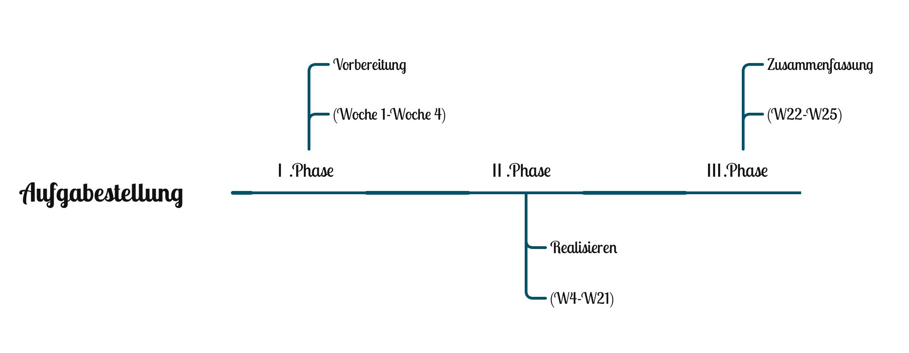
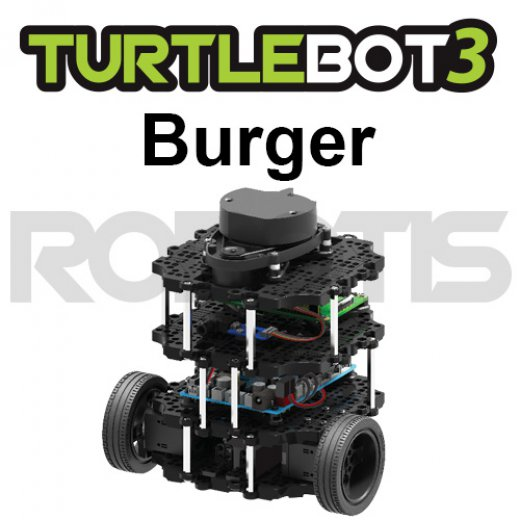

.. Ablaufplan documentation master file, created by
   sphinx-quickstart on Mon Mar 15 22:14:54 2021.
   You can adapt this file completely to your liking, but it should at least
   contain the root `toctree` directive
   
   
Ablaufplan von Yanchi Lai über SA-Thema Turtlebot 3 
+++++++++++++++++++++++++++++++++++++++++++++++++++++++++++++++++++++++++

.. toctree::
   :maxdepth: 2
   :caption: Contents:

Ich habe insgesamt ca. 25 Wochen, um diese Aufgabe zu erledigen.

Ⅰ.Phase-Vorbereitung (Woche 1-Woche 4)：
************************************************

1. eine innere WIKI-Seite über TURTLEBOT3 im LWM-WIKI erstellen 

2. Hinweis: jederzeit nachfolgende Dateien hinzufügen (z.B. SolidWorks-Dateien von TURTLEBOT3)

3. mehr über ROS und verstärken Python-Fähigkeit erfahren

4. die Erweiterungen und das Verwendungfahren des Raspberry Pi 4 lernen

Ⅱ.Phase - Realisieren(W4-W21)：
***************************************

1. Turtlebot3 und Raspberry Pi 4 physisch anschließen (Motor, Batterie usw.) - W4 / 5

2. das Betriebssystem auf dem Raspberry Pi 4 installieren und eine Verbindung zu WLAN für die Fernbedienung herstellen - W5 / 6

3. RealSense D435 Camera installieren -W7 / 8

4. PCL zur Objekterkennung und Entfernungsmessung verwenden,  und immer dauernter Test - W9-21

(www.turtlebot.de)

.. image:: 3.jpg

(www.wikipedia/rasperry.de)

Ⅲ.Phase - Zusammenfassung（W22-W25）：
********************************************************
1.  das Praxisergebnis optimieren, zusammenfassen; Abschlussarbeiten schreiben, mich auf die Verteidigung vorbereiten

